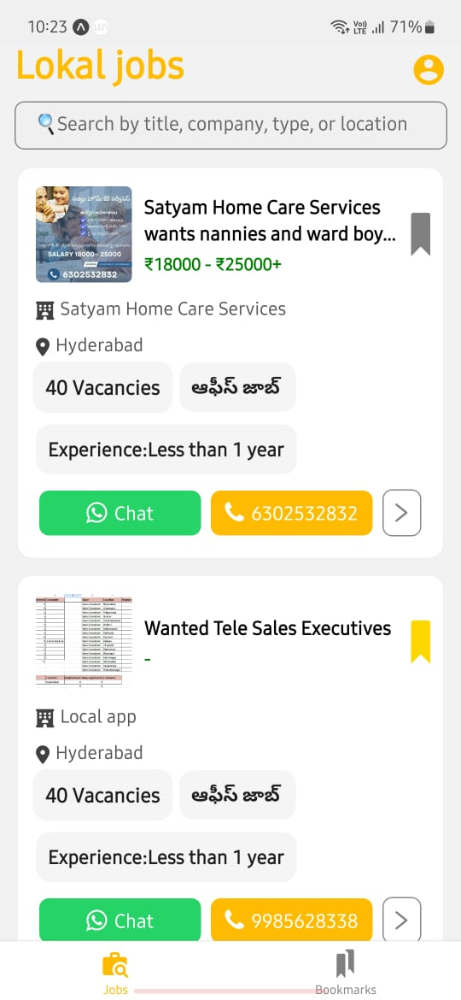
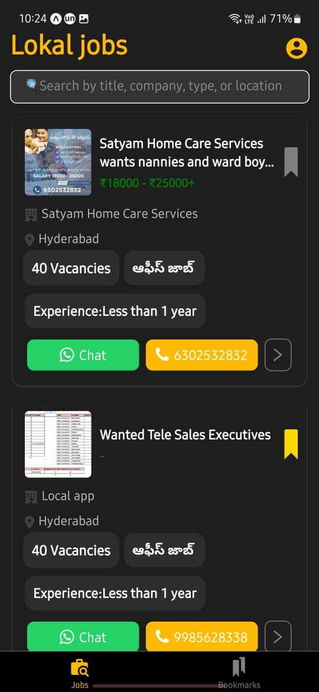
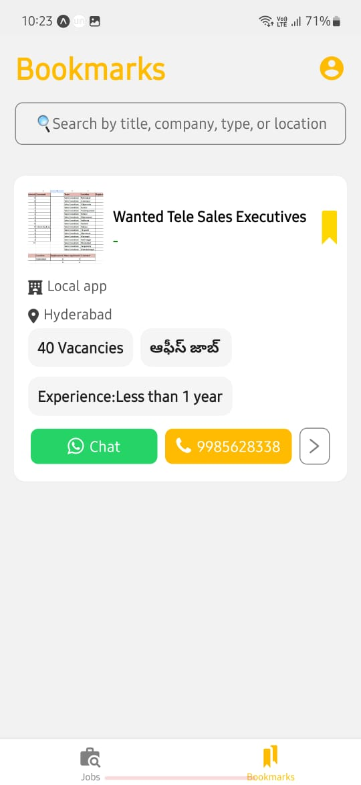
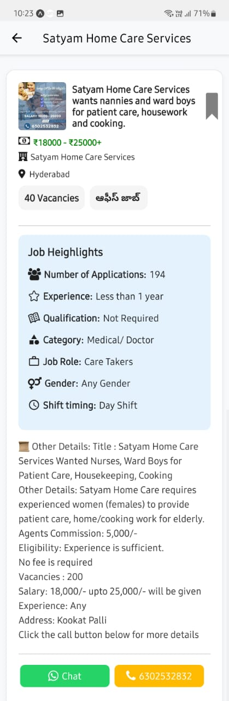

# 📱 Job Board App

A mobile job board application built with **Expo**, allowing users to browse job listings, save bookmarks, and manage their job search efficiently.


## 📸 Screenshots
<div style="display: flex; flex-wrap: wrap; gap: 10px;">
  
  
   
  
  
  
</div>

<hr></hr>

## 📹 Demo
🎥 Watch the app in action: [Video Demo](https://drive.google.com/file/d/1KOeTbJMQzumrIujS6ZEhLZu1rUqVj8V_/view?usp=sharing)

## 📄 Documentation
📖 Read the full documentation: [Google Docs](https://docs.google.com/document/d/1kW5TBDXTRV4RGegYSqrWS0fLRg-fj237/edit?usp=sharing)


## 🔧 Installation & Setup

### Prerequisites
Ensure you have the following installed:
- [Node.js](https://nodejs.org/)
- [Expo CLI](https://docs.expo.dev/get-started/installation/)
- [Git](https://git-scm.com/)

### Steps

```sh
# Clone the repository
git clone https://github.com/akhilsaisriram/lokal-assignment.git

# Navigate to project directory
cd lokal-assignment

# Install dependencies
npm install 
 # or
yarn install

# Start the Expo development server
npx expo start 
```


## 🚀 Features

### 🖥 User Interface
- **Bottom Navigation:** Tab system for easy navigation between Jobs and Bookmarks.
- **Dynamic Theming:** Adapts to light/dark mode based on the device settings.
- **Search Functionality:** Filter jobs by title, company, location, or type.
- **Bookmark Management:**
  - Select multiple jobs from bookmarks.
  - Toggle **Select All / Deselect All**.
  - Delete selected jobs from local storage.

### ⚡ Core Functionality
- **Infinite Scrolling:** Progressive loading of job listings as the user scrolls.
- **Bookmark System:** Save and remove jobs with a tap, stored locally for offline access.
- **Job Details:** View detailed job descriptions by tapping any job card.

### 🎯 Performance & UX
- **Swipe Gestures:** Swipe left/right to bookmark/unbookmark jobs.
- **Loading States:** Indicators for smooth user experience.
- **Error Handling:** Displays meaningful messages for network issues.
- **Snackbar Notifications:** Confirms bookmark actions (e.g., "Bookmarked Successfully").

## 🛠️ Tech Stack
- **Navigation:** [Expo Router](https://expo.github.io/router/docs/) for tab navigation.
- **State Management:** [AsyncStorage](https://react-native-async-storage.github.io/async-storage/) for persistent bookmarks.
- **Animations:** [React Native Reanimated](https://docs.swmansion.com/react-native-reanimated/) for smooth UI transitions.
- **HTTP Requests:** [Axios](https://axios-http.com/) with error handling.


